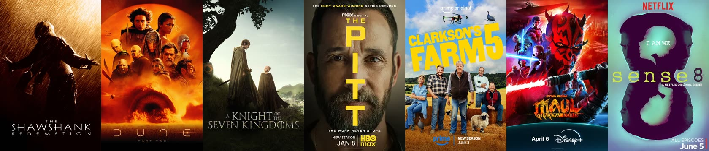

<div align="center">
  
  <h1>GRINGOTTS</h1>
  <p>一个安静的双语影视收藏站</p>
  <p>
    <a href="https://www.gringotts04.cc/"><strong>访问 GRINGOTTS →</strong></a>
  </p>
</div>



GRINGOTTS 是一个纯静态的双语影视收藏站，以本地海报为主的响应式作品墙，用来整理和浏览电影与剧集收藏。页面主体居中显示，桌面端每行展示 6 部作品，每页 12 部。

## 功能

| | |
| --- | --- |
| **双语界面** | 在中文与 English 之间切换 |
| **实时搜索** | 按中英文片名查找作品 |
| **筛选与排序** | 按类型、电影 / 剧集筛选，并按年份、IMDb 或豆瓣评分排序 |
| **分页浏览** | 桌面端每页两行共 12 部作品，支持页码切换与直接跳转 |
| **作品详情** | 点击海报进入详情页，查看双语简介、资料来源及 IMDb、豆瓣评分 |
| **双语简介** | 英文简介取自 TMDB，中文译文保留人物等专名，并使用常见地名与机构的通行译名 |
| **本地海报** | 海报随站点加载，移动端筛选栏默认收起 |

## 文件说明

```text
├── index.html                # 页面结构
├── style.css                 # 响应式样式与居中页面布局
├── script.js                 # 搜索、筛选、排序、分页与详情页
├── data.js                   # 作品基础数据
├── descriptions.js          # 原有中英文简介与来源
├── tmdb-descriptions.js     # 页面使用的 TMDB 双语简介
├── tmdb-en-results.json     # TMDB 英文简介原始结果
├── tmdb-zh-results.json     # 中文翻译及专名保护结果
├── scripts/                  # TMDB 获取、翻译和生成脚本
├── covers/                   # 本地海报
├── assets/                   # README 图片
└── favicon.ico               # 网站图标
```

## 更新作品

在 `data.js` 添加作品数据，并将对应海报放入 `covers/`。四位以下的作品 ID 需在文件名左侧补零至四位，例如 ID `36` 对应 `covers/0036.jpg`；更长的 ID 直接作为文件名。

如需重新获取并生成 TMDB 简介，在 `.env.local` 中配置 `TMDB_READ_ACCESS_TOKEN`，然后依次运行：

```powershell
node scripts/fetch-tmdb-en.js
node scripts/translate-tmdb-zh.js
node scripts/build-tmdb-en.js
```

生成脚本会保留英文原文，并在中文译文中使用常见地名、历史事件和机构的中文通行译名。

---

<div align="center">
  联系：<a href="mailto:maox_115@163.com">maox_115@163.com</a>
</div>
